# Didi Competition ( round 1 )
----------
   ## car detection using LIDAR data only
   

The following animation shows the final results of vehicle prediction on test dataset by applying the U-net algorithm.

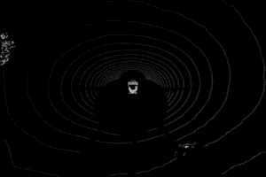

[Here](https://github.com/omgteam/Didi-competition-solution) you can find more instructions about how to deal with visualization, caliberation, and detection ROS nodes.


## LIDAR Visualization on ROS


To visualize Dataset Release provided by Udacity, we need to convert ` topic /velodyne_packets to /velodyne_points`. We need to install ROS velodyne drivers [here](https://github.com/ros-drivers/velodyne.git), and then do the following instructions:

  $ roslaunch velodyne_pointcloud 32e_points.launch
  
  $ roslaunch `didi_visualize display_rosbag_rviz.launch rosbag_file:=PATH/NAME.bag`


>This module is borrowed from [here](https://github.com/jokla/didi_challenge_ros).

You will get something looks like as same as what the following animation displayed when you play a rosbag file and visualize the result in RViz

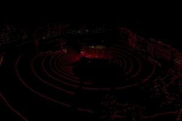

## Car Detection

I used the small U-net for detecting vehicles by using lidar data only(the lidar data is provided by KITTI). U-net is a encoder-decoder type of network for pixel-wise predictions(image segmentation). What makes U-net unique is because it obtains a special shape of layer where the feature maps from one convolution part in `downsampling ` step are going to be fed to the up-convolution part in `up-sampling` step.


The following figure could provide you with a better view of how U-net model works.
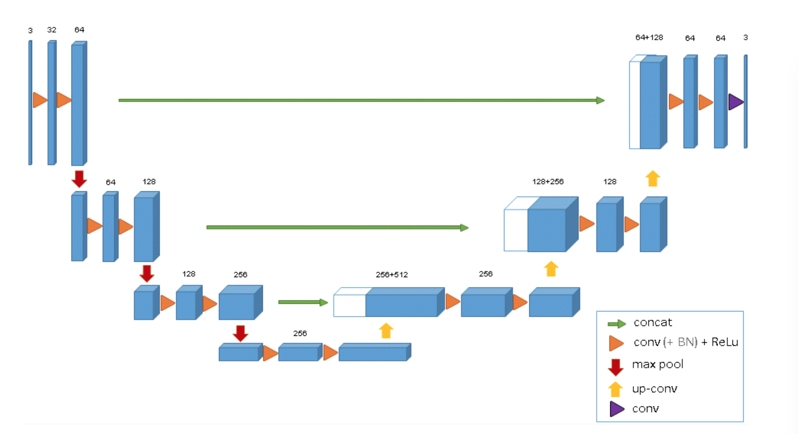


The original research paper on U-net is [here](https://lmb.informatik.uni-freiburg.de/people/ronneber/u-net/).

## Training Data

* KITTI Data
        KITTI dataset is a freely available data of a car driving in urban environment. The KITTI car has 4 cameras (2 stereo color and 2 stereo grayscale), velodyne’s VLP-64 LIDAR and an GPS/IMU. In addition calibration data are provided so transformations between velodyne (LIDAR), IMU and camera images can be made.
        

### Exploratory data analysis of KITTI dataset

the LIDAR data output is a set of points x,y,z and reflective intensity from these points. We will use these points to make our front-view & top-view lidar based image.

|original image   | front  view   | top view       |
|-----------------|:--------------|:---------------|
||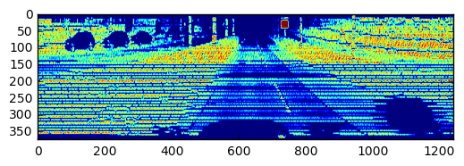|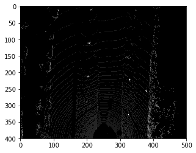|


* top view of lidar data based on the original image

|           original image                |           top view                   |
|--------------------------|:-----------------------------|
|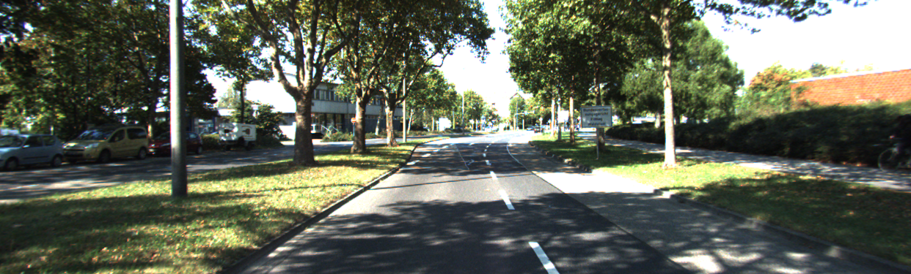 | 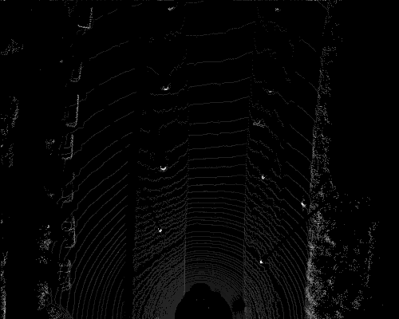|


As the top-view image shown above, it could present vehicles that are not even in the field of view of the front camera. Thus I decided to use only top-view lidar data to train the model and see how accurate it will be to detect vehicles. 

This snippet code shows the way of creating the birdseye view of lidar data is borrowed from [here](http://ronny.rest/tutorials/module/pointclouds_01/point_cloud_birdseye/) .


```python
def point_cloud_2_birdseye(points,
                           res=0.1,
                           side_range=(-10., 10.),  # left-most to right-most
                           fwd_range = (-10., 10.), # back-most to forward-most
                           height_range=(-2., 2.),  # bottom-most to upper-most
                           ):
    """ Creates an 2D birds eye view representation of the point cloud data.

    Args:
        points:     (numpy array)
                    N rows of points data
                    Each point should be specified by at least 3 elements x,y,z
        res:        (float)
                    Desired resolution in metres to use. Each output pixel will
                    represent an square region res x res in size.
        side_range: (tuple of two floats)
                    (-left, right) in metres
                    left and right limits of rectangle to look at.
        fwd_range:  (tuple of two floats)
                    (-behind, front) in metres
                    back and front limits of rectangle to look at.
        height_range: (tuple of two floats)
                    (min, max) heights (in metres) relative to the origin.
                    All height values will be clipped to this min and max value,
                    such that anything below min will be truncated to min, and
                    the same for values above max.
    Returns:
        2D numpy array representing an image of the birds eye view.
    """
    # EXTRACT THE POINTS FOR EACH AXIS
    x_points = points[:, 0]
    y_points = points[:, 1]
    z_points = points[:, 2]

    # FILTER - To return only indices of points within desired cube
    # Three filters for: Front-to-back, side-to-side, and height ranges
    # Note left side is positive y axis in LIDAR coordinates
    f_filt = np.logical_and((x_points > fwd_range[0]), (x_points < fwd_range[1]))
    s_filt = np.logical_and((y_points > -side_range[1]), (y_points < -side_range[0]))
    filter = np.logical_and(f_filt, s_filt)
    indices = np.argwhere(filter).flatten()

    # KEEPERS
    x_points = x_points[indices]
    y_points = y_points[indices]
    z_points = z_points[indices]

    # CONVERT TO PIXEL POSITION VALUES - Based on resolution
    x_img = (-y_points / res).astype(np.int32)  # x axis is -y in LIDAR
    y_img = (-x_points / res).astype(np.int32)  # y axis is -x in LIDAR

    # SHIFT PIXELS TO HAVE MINIMUM BE (0,0)
    # floor & ceil used to prevent anything being rounded to below 0 after shift
    x_img -= int(np.floor(side_range[0] / res))
    y_img += int(np.ceil(fwd_range[1] / res))

    # CLIP HEIGHT VALUES - to between min and max heights
    pixel_values = np.clip(a=z_points,
                           a_min=height_range[0],
                           a_max=height_range[1])

    # RESCALE THE HEIGHT VALUES - to be between the range 0-255
    pixel_values = scale_to_255(pixel_values,
                                min=height_range[0],
                                max=height_range[1])

    # INITIALIZE EMPTY ARRAY - of the dimensions we want
    x_max = 1 + int((side_range[1] - side_range[0]) / res)
    y_max = 1 + int((fwd_range[1] - fwd_range[0]) / res)
    im = np.zeros([y_max, x_max], dtype=np.uint8)

    # FILL PIXEL VALUES IN IMAGE ARRAY
    im[y_img, x_img] = pixel_values

    return im
```

### Exploratory data analysis of Didi dataset

The big difference between kitti and didi dataset is that the LIDAR on KITTI is composed of an array of 64 laser units,however, Didi challenge dataset is collected using VLP-16 lidar.

Here are two figures presented below show the results by using VLP-64 and VLP-16 lidar.


|           VLP-64         |          VLP-16              |
|--------------------------|:-----------------------------|
| | 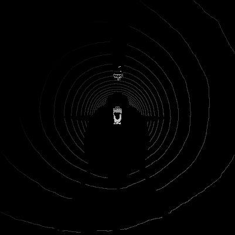|

## Didi data Preprocessing and Augmentation

* Translation

I randomly shifted the birdseye image +-50 from the original.

here is an example shows this step.

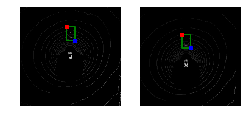
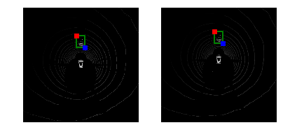

* Rotation

I randomly rotated the birdseye image to +-90,+-180,+-270 from the original.

here are examples show this step.

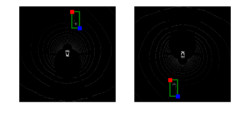
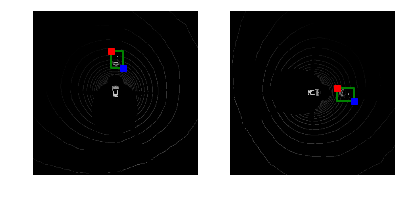

* Stretch

I randomly enlarged/narrowed the vehicle in range of (+/-20).

here is an example shows this step.

** enlarge**
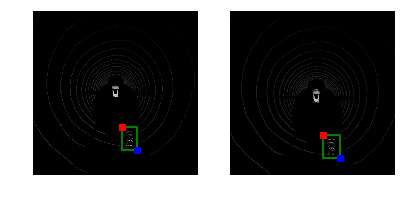

** narrow**
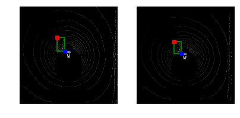
---

I didn't apply methods of  `saturation`, `brightness` and `contrast` to change the values of pixels as I found adding them would cause more useless noises that more cloud points were generated by doing so. Thus I escaped augmenting lidar data by using these functions.

The following example images show the results after applying saturation.

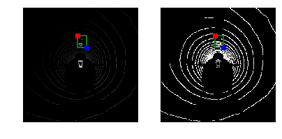

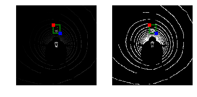

## Mask
Next we are going to apply the mask to take the segmentation of that vehicle out and leaves the rest as black, we then feed them to the U-net for trainning.

here is an example shows this step.
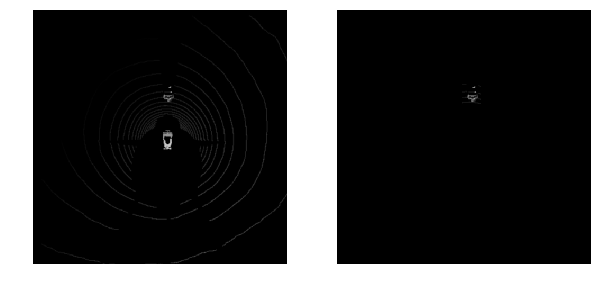
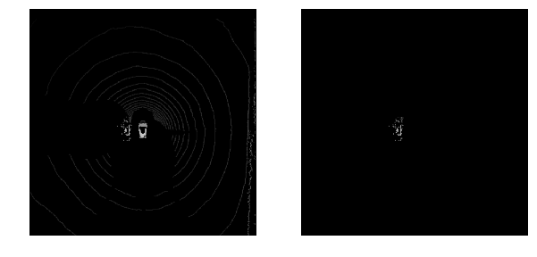

## Training

The input to U-net is a resized 480X480 image, the output is 480X480 1-channel mask of predictions. We then use an activation function of sigmoid on the last layer to predict how many pixels respresent in the place of where a vehicle will be. 
I chose a batch size of 1 for all architectures. This 1 image was randomly picked and augmented from all training images. Also I chose  the adam optimizer with a learning rate of 0.0001 for it. Training the segmentation model toke me about 24 minutes at each time.

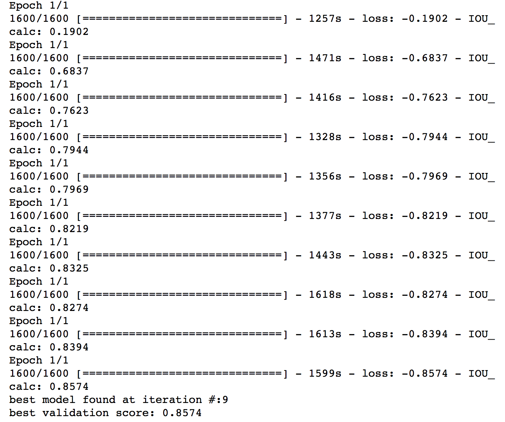

## Results 

Surprisingly, with the small number of training dataset, this neural network could predict the car with higher accuracy. Figures below present result of segmentation algorithm applied for vehicle predictions. The panels are organized as the original image, predicted mask and the corresponding predicted bounding boxes.

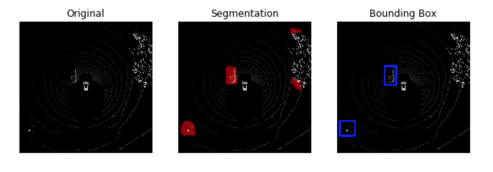


* on KITTI data

Also, I trained the KITTI data to the U-net model as well and found the results would be better than I thought. This neural network was able to identify cars almost correct from the test images.


|           original         |    predicted segmentation              |
|--------------------------|:-----------------------------|
|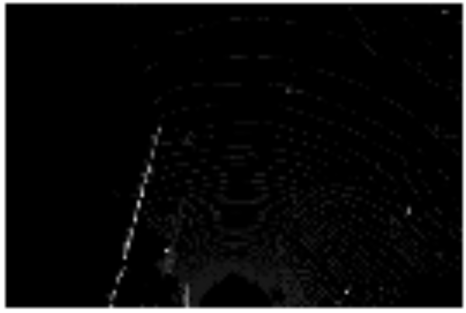 | 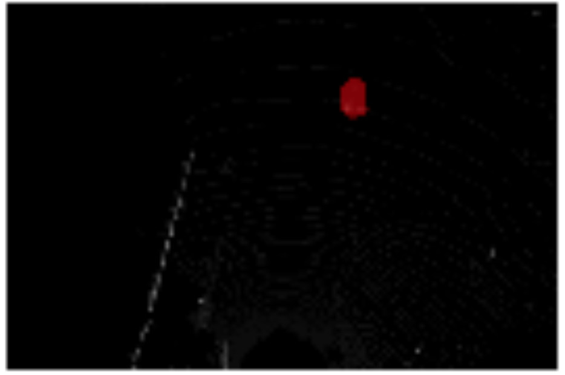|

|           original         |    predicted segmentation              |
|--------------------------|:-----------------------------|
|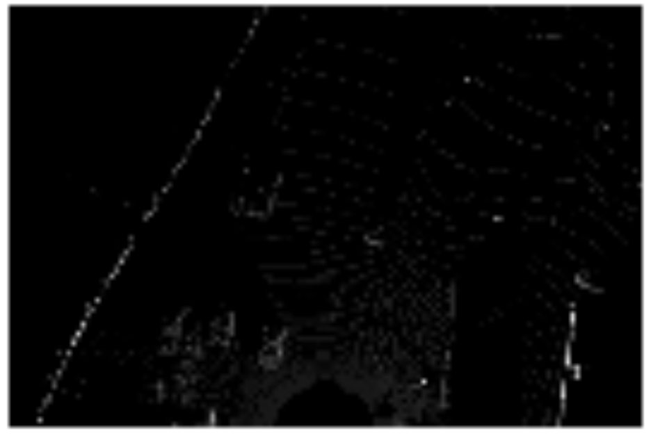 | 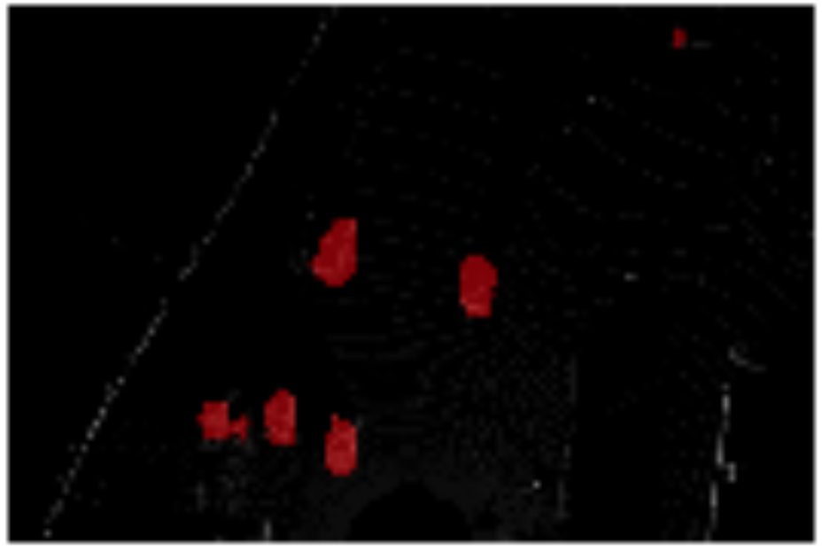|


# Reflection

 * Working with LIDAR data is not easy, and some shapes of non-vehicles look so similar to some shapes of vehicles and thus make the model harder to detect them correctly. In addition, it becomes even hard when we try to identify pedestrians by feeding only top-view lidar training data, as the segmentation of this class was too small to be distinguished.  


 * KITTI dataset uses VLP-64 and Didi data uses VLP-16. Therefore, some type of upsampling may be needed to generate more points for preprocessing. 


 * I believe feeding only bird's eye view of lidar data is far from enough, and thus combining with camera data set(the RGB image) and the front view of lidar data would be necessary. Thus I need to build a more robust model to collect these three different types of data which are the `front view proposal`,`top view proposal` and `image proposal` respectively, and then feed them to the feature fusion network to make predictions of classification and the corresponding bounding box. 


```python

```
